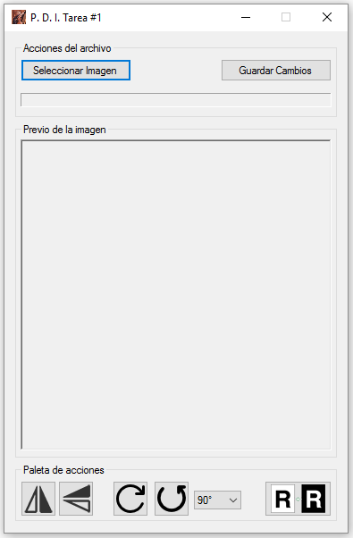

# Tarea #1 Procesamiento Digital de Imágenes

>Se requiere que Ud. Desarrolle una aplicacion en el lenguaje de programacion de su 
preferencia que permita leer un archivo en formato .bmp sin compresion y pueda ser mostrado. Adicional, se requiere que contenga las siguientes operaciones:
> - Obtener el negativo.
> - Rotar la imagen 90◦ , 180◦  y 270◦  en sentido CW/CCW.
> - Realizar las operaciones de espejo horizontal y vertical.

>Las imagenes pueden ser con paleta de colores (1, 4, 8 bits) o sin paleta (24 bits). El lenguaje de programacion seleccionado debe permitir leer archivos en formato binario para la lectura y ofrecer una interfaz de usuario adecuada para anadir controles. El sistema operativo de su aplicacion debe ser Windows o basado en Linux.

- - - - 
### Estructura del Repositorio

Dillinger uses a number of open source projects to work properly:

* [src/] - Contiene el código fuente (Los archivos *.CS)
* [ide/] - Contiene los archivos relacionados al proyecto en Visual Studio 2015.
* [bin/] - Contiene la versión ejecutable para Windows de la tarea.
* [build/] - Contiene los archivos generados por el compilador Visual Studio 2015.
* [doc/] - Contiene la documentación empleada para la elaboracion de la asignació.
- - - - 
### Ejecucion del Programa

Dentro de la carpeta [bin/] se encuentra el archivo ejecutable del proyecto, basta con descargarlo y ejecutar este programa. Esto mostrará una interfaz grafica bastante intuitiva que permitirá cargar la imagen y aplicar las distintas operaciones requeridas.

- - - - 
### Versión
1.0
- - - - 
### Autor
**Nombre:** Jorge Taoufik Khabazze Maspero  
**C.I.:** 23.692.079  
**E-Mail:** jtkm6jk@gmail.com

   [src/]: <./src/>
   [ide/]: <./ide/>
   [bin/]: <./bin/>
   [build/]: <./build/>
   [doc/]: <./doc/>